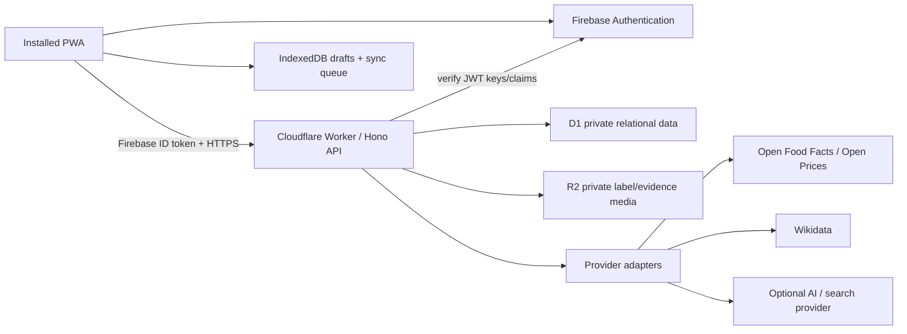
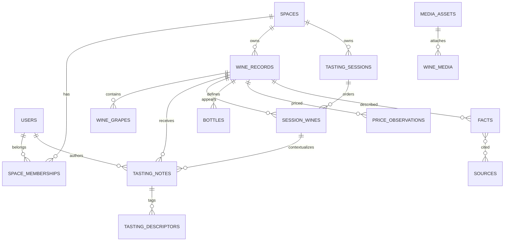

# Va de Vi

## Codex-ready product and implementation specification

| Field | Value |
|---|---|
| Version | 1.0 |
| Status | Approved implementation baseline |
| Date | 2026-08-12 |
| Primary audience | Codex and the human product owner |
| Initial release | Private, self-hosted PWA |
| Product languages | Catalan, Spanish, French, English, Italian, Portuguese, Dutch, German |

> **Implementation instruction for Codex:** treat every `MUST` and acceptance criterion in this document as required. If two requirements appear to conflict, protect privacy and data integrity first, preserve the zero-cost core second, and record the resolution in an ADR before proceeding. Do not silently broaden scope.

### Contents

1. [Executive summary](#1-executive-summary)
2. [Product principles](#2-product-principles)
3. [Vocabulary and domain rules](#3-vocabulary-and-domain-rules)
4. [Users, permissions, and collaboration](#4-users-permissions-and-collaboration)
5. [Functional scope](#5-functional-scope)
6. [Information architecture and experience](#6-information-architecture-and-experience)
7. [Architecture](#7-architecture)
8. [Authentication and request authorization](#8-authentication-and-request-authorization)
9. [Data model](#9-data-model)
10. [HTTP API contract](#10-http-api-contract)
11. [Vicenç Vinyes tool contracts](#11-vicenç-vinyes-tool-contracts)
12. [External data and provider adapters](#12-external-data-and-provider-adapters)
13. [Internationalization](#13-internationalization)
14. [PWA and offline behavior](#14-pwa-and-offline-behavior)
15. [Security and privacy](#15-security-and-privacy)
16. [Zero-cost operating profile](#16-zero-cost-operating-profile)
17. [Repository structure](#17-repository-structure)
18. [Testing and quality strategy](#18-testing-and-quality-strategy)
19. [Implementation phases](#19-implementation-phases)
20. [MVP acceptance criteria](#20-mvp-acceptance-criteria)
21. [Explicit non-goals](#21-explicit-non-goals)
22. [Delivery and release checklist](#22-delivery-and-release-checklist)
23. [Open decisions requiring product-owner approval](#23-open-decisions-requiring-product-owner-approval)
24. [Definition of done](#24-definition-of-done)

---

## 1. Executive summary

Va de Vi is a private, collaborative wine memory, tasting, learning, and discovery application. It is not a public ratings network and must not be implemented as a thin clone of Vivino or CellarTracker.

The product should answer four questions:

1. What did I drink?
2. What did I think about it?
3. What did I learn about it?
4. What should I drink or buy next?

The core product model is **Spaces + Flows**:

- A **Space** identifies who owns and shares the data: personal, couple, or group.
- A **Flow** identifies what the user is doing: quick logging, structured tasting, a tasting session, shopping, or exploring Wine Memory.

This replaces separate “single/couple/group modes.” A user may belong to several Spaces and switches the active Space from the app header. All persistent domain data belongs to exactly one Space. A user may search across multiple Spaces only when they are an active member of each.

The differentiator is cumulative, evidence-aware memory. Va de Vi distinguishes:

- **Observed** — entered by a person or visible on a label.
- **Researched** — supported by an external source.
- **Inferred** — derived from available evidence and clearly marked as uncertain.
- **Personal** — derived from a member’s own tasting history.

Vicenç Vinyes is a warm, concise, slightly playful sommelier companion. He is an orchestrator over scoped application tools, not an all-knowing chatbot. He must cite researched claims, explain recommendations, state uncertainty, and never mutate durable data without a user confirmation step.

### 1.1 MVP definition

The MVP includes:

- Google sign-in and first-run onboarding.
- Personal, couple, and group Spaces with owner/admin/member roles and invitations.
- Manual wine entry and photo-assisted identification as a draft that the user confirms.
- Quick and deep individual tasting notes.
- Optional tasting context: serving, glass, environment, food, and sequence.
- Multi-wine tasting sessions with individual notes and computed group comparisons.
- Wine Memory with cards, table, sessions, filters, search, and export.
- Light wishlist, purchase, and bottle inventory.
- Evidence-backed facts, sources, curiosities, and further-reading links.
- Basic shopping assistance and timestamped price observations; no promise of complete market coverage.
- Vicenç read-only questions, comparisons, explainable recommendations, research, and confirmation-based action drafts.
- Installable PWA behavior and offline capture/sync for core logging.
- All eight target interface languages before the MVP is declared complete.
- A zero-cost operating profile with hard limits and graceful degradation.

### 1.2 Post-MVP candidates

- Blind tasting and reveal workflow.
- Multi-label shelf-photo segmentation.
- Real-time collaborative editing.
- Map and geographic history.
- Advanced cellar planning and drink windows.
- Calibrated preference prediction.
- Public sharing links, if privacy design is revisited.
- Native mobile applications.

---

## 2. Product principles

1. **Private by default.** No Space, wine, photo, tasting, location, or chat is public.
2. **Individual opinion is not group opinion.** Shared sessions contain one note per participant; group summaries are computed artifacts, not overwritten individual notes.
3. **Fast path first.** Logging a wine must not force a deep tasting questionnaire.
4. **Confirm identity before canon.** OCR, barcode, and model output create candidates, never silent canonical records.
5. **Facts require provenance.** Researched facts retain their sources and retrieval date.
6. **Explain, do not fake precision.** Use “strong match,” “good match,” and “adventurous” until a prediction model is demonstrably calibrated.
7. **Offline capture is a first-class path.** A restaurant with poor connectivity must not prevent a user from saving a note.
8. **No paid dependency for core use.** AI and broad web search may enhance the product but cannot be required to log, taste, search local history, or export.
9. **Accessible and calm.** The visual atmosphere may evoke *Her*, but usability, contrast, keyboard navigation, and reduced motion take precedence.
10. **Portable data.** Users can export their own Space data and delete it.

---

## 3. Vocabulary and domain rules

| Term | Definition |
|---|---|
| User | An authenticated person, identified by Firebase Authentication. |
| Space | A private tenant containing members and wine data. Type: `personal`, `couple`, or `group`. |
| Active Space | The Space whose data is currently shown and mutated. |
| Wine record | A Space-scoped definition of a wine/cuvée and optional vintage. It is not an individual physical bottle. |
| Bottle | A physical bottle owned by a Space. |
| Tasting note | One member’s subjective assessment of one wine on one occasion. |
| Session | An ordered flight of one or more wines tasted on a shared occasion. |
| Session summary | A reproducible computed comparison across submitted individual notes. |
| Fact | A structured claim about a subject with evidence class, confidence, and optional citations. |
| Source | A URL or user-provided artifact supporting one or more facts. |
| Price observation | A price seen at a merchant, purchase, receipt, shelf, or external source at a specific time. |
| Wine Memory | The user-facing history and search experience. |
| Vicenç | The assistant persona and server-side tool orchestrator. |

### 3.1 Invariants

- Every domain row is scoped by `space_id`, directly or through a parent with an enforced ownership check.
- A personal Space has exactly one active member and that member is owner.
- A couple Space supports two intended members. Do not hard-delete or corrupt data if temporarily one or more than two memberships exist during invitation/administration; enforce the product rule at command validation.
- A group Space has two or more intended members.
- A tasting note has exactly one author. Consensus is stored separately.
- A session wine has a stable, unique position within a session.
- Wine definitions and bottles are separate.
- External identifiers are hints, not guaranteed unique wine identifiers. EAN/UPC may identify a product family rather than a vintage.
- Scores are stored as integer `score_100` values from 0 to 100; the default UI displays 0.0–5.0.
- Timestamps are UTC ISO 8601 strings with millisecond precision. User-facing time is localized.
- IDs are application-generated ULIDs stored as text. IDs reveal ordering but no personal information.
- Mutable resources have an integer `version` beginning at 1 for optimistic concurrency.
- User-generated text remains in its original language unless the user explicitly requests a translation.

---

## 4. Users, permissions, and collaboration

### 4.1 Roles

MVP roles are `owner`, `admin`, and `member`. A `viewer` role is reserved for later and must not appear in production UI.

| Capability | Owner | Admin | Member |
|---|:---:|:---:|:---:|
| Read Space data | ✓ | ✓ | ✓ |
| Create wines, notes, sessions, prices | ✓ | ✓ | ✓ |
| Edit own tasting notes | ✓ | ✓ | ✓ |
| Edit another member’s tasting note | — | — | — |
| Correct shared wine metadata | ✓ | ✓ | ✓ |
| Invite members | ✓ | ✓ | — |
| Remove a member | ✓ | ✓, except owner | — |
| Change member roles | ✓ | — | — |
| Rename/configure Space | ✓ | ✓ | — |
| Export Space | ✓ | ✓ | own contributions only |
| Delete Space | ✓ | — | — |
| Transfer ownership | ✓ | — | — |

An owner or admin may hide an abusive or accidental shared record, but may not impersonate another author. Administrative changes must be audited.

### 4.2 Onboarding

1. User signs in with Google.
2. The API upserts the user profile using Firebase `uid`; email is stored normalized and is not used as a primary key.
3. The UI asks for display name and preferred locale, prefilled from the identity provider/browser.
4. A personal Space is created automatically and idempotently.
5. The user may create a couple/group Space or accept an invitation.
6. The selected active Space is stored as a user preference and locally for fast startup.
7. The onboarding sequence can be resumed after interruption.

### 4.3 Invitations

- MVP invitations use a shareable, single-use link. Email delivery is not required for zero-cost operation.
- Store only a SHA-256 hash of the random invite token.
- Tokens expire after seven days by default and can be revoked.
- The acceptance endpoint requires authentication, is idempotent, and shows the Space name and inviter before confirmation.
- Error responses must not reveal Space membership or whether a specific email is registered.
- Couple-Space acceptance must enforce the intended membership rule.

---

## 5. Functional scope

### 5.1 Flow A — Quick Log

Entry methods:

- Photograph a bottle/label.
- Type the wine details.
- Tell Vicenç by text; voice input is an optional enhancement.

Photo-assisted sequence:

1. The client crops, rotates, downsizes, and strips metadata before upload.
2. Barcode detection and/or OCR produces a draft candidate.
3. Optional external adapters enrich the candidate.
4. The UI displays field-level confidence and conflicts.
5. The user confirms or edits producer, wine name, vintage, region, and other fields.
6. Only confirmation creates or links a canonical Space-scoped wine record.

After confirmation, offer:

- **Quick note** — score, sentiment, drink again, buy again, 1–3 descriptors, food, short comment.
- **Taste it** — the deep structured path.
- **Log only** — occurrence without a tasting note.

The whole manual quick-log path must be usable offline.

### 5.2 Quick tasting

Required: wine, Space, author, tasted-at date/time. Everything else is optional.

Supported fields:

- `score_100`
- sentiment: `dislike`, `neutral`, `like`
- would drink again: `yes`, `no`, `unsure`
- would buy: `yes`, `no`, `unsure`
- selected descriptors
- food text and structured food tags
- short comment
- perceived value, when a price is known

### 5.3 Deep tasting

Va de Vi uses an original ontology inspired by the universal tasting progression, not copied proprietary tasting text.

**Appearance**

- clarity
- color family and hue
- intensity
- rim evolution
- viscosity
- free observation

**Nose**

- clean / possible fault
- intensity
- aroma families and descriptors
- freshness
- development
- free observation

**Palate**

- sweetness
- acidity
- tannin level and texture
- alcohol perception
- body
- flavor intensity
- texture
- flavor descriptors
- finish length
- balance
- complexity
- free observation

**Personal conclusion**

- enjoyment and score
- drink/buy again
- perceived value
- memorable
- pairing success
- expected versus actual
- tasting confidence
- free conclusion

Structured scales use stable numeric codes; translated labels and help text are presentation data.

### 5.4 Optional tasting context

**Wine conditions:** serving temperature, opened state, minutes since opening, decanted, aeration time, preservation method, bottle condition.

**Glass:** tulip, Bordeaux-style, Burgundy-style, flute/sparkling, small wine glass, tumbler, restaurant generic, other.

**Environment:** home, restaurant, bar, winery, class, event, outdoors, other; optional room temperature, light, noise, ambient smells.

**Sequence and food:** food before/during, palate cleanser, and prior wine in a flight.

Do not collect health, sleep, or mood in the MVP.

### 5.5 Flow B — Tasting Session

- Create a named, dated session in a Space.
- Add wines individually or as a batch.
- Preserve flight order.
- Allow each participant to create and edit only their own notes.
- Show completion state without exposing another participant’s hidden blind-tasting input.
- Compute a summary only from submitted notes.
- Recompute summaries when an included note changes; record algorithm version.

Session comparison includes, when data is sufficient:

- per-person and group score
- group ranking
- favorite by person and overall
- most divisive
- descriptor overlap/disagreement
- relative acidity/body/intensity
- buy-again count
- best perceived value
- most surprising

No group score is shown when fewer than two submitted notes exist. Avoid implying statistical significance for small samples.

### 5.6 Flow C — Shopping

Three subflows are supported.

**What should I buy?** Ask progressively for occasion, food, budget, safe-versus-new preference, and the target person/Space. Recommendations must cite relevant preference evidence and acknowledge insufficient history.

**Compare what is in front of me.** MVP accepts individually photographed or manually entered candidates. Compare against the selected person/Space’s history. Use qualitative match labels, not percentages.

**Find this bottle.** Return only offers or observations actually found. Each entry must show merchant, price, currency, exact wine/vintage match quality, physical/online status when known, observed time, and source. Stale data must be visibly stale.

The zero-cost profile does not promise comprehensive store coverage. Manual shelf/receipt/purchase observations are fully supported. External search connectors are optional.

### 5.7 Flow D — Wine Memory

Views:

- Cards, optimized for imagery and recall.
- Table, optimized for filtering and export.
- Timeline.
- Sessions.
- Map is post-MVP.

Filters/search fields include wine, producer, grape, country, region, appellation, vintage, participant, rating, date, location text, food, descriptor, style, price, buy-again, wishlist/ownership state, and tag.

Natural-language search is implemented by Vicenç translating a request into a validated `search_memory` tool call. It must not generate arbitrary SQL.

### 5.8 Light cellar, purchases, and wishlist

A wine may be tasted, wishlisted, owned, opened, finished, or gifted. These are events/relationships, not one overloaded status on the wine record.

- A purchase records merchant, price, currency, date, quantity, and optional evidence.
- A purchase may create one or more bottle rows.
- A bottle has lifecycle state `owned`, `opened`, `finished`, `gifted`, or `removed`.
- A wishlist item stores reason, priority, target price, source/referrer, and notes.
- Inventory counts are derived from bottle rows and never manually cached without a consistency test.

### 5.9 Learning and curiosities

Research may create source-backed facts about:

- the wine/cuvée
- producer history and people
- region, climate, geography, and regulations
- grapes and aliases
- production techniques
- cultural references in books, films, music, or history
- further reading: article, producer page, video, podcast, interview, documentary, or book

The UI must show source, publisher, retrieval date, evidence class, and conflicts. Preferred authority order for wine attributes is:

1. producer or technical sheet
2. appellation/regulator
3. reputable specialist source
4. structured open dataset
5. other web source

Conflicting claims remain visible. A verified preferred fact may be selected without deleting alternatives.

### 5.10 Vicenç Vinyes

Persona: knowledgeable, warm, curious, concise, slightly playful, and never snobbish.

Vicenç must:

- answer from authorized Spaces only
- distinguish observed, researched, inferred, and personal statements
- attach citations to researched claims
- explain recommendations in ordinary language
- say when data is missing
- ask a focused question when it materially improves an answer
- produce action drafts that require explicit UI confirmation
- respond in the user’s selected language unless asked otherwise

Vicenç must not:

- invent a wine, merchant offer, price, source, or personal preference
- imply access to data outside the current user’s memberships
- execute arbitrary SQL, HTTP requests, or code
- silently save or edit durable records
- expose hidden prompts, tokens, credentials, or raw third-party content

---

## 6. Information architecture and experience

### 6.1 Primary navigation

Mobile bottom navigation:

1. Home
2. Log
3. Sessions
4. Memory
5. Vicenç

Desktop uses the same information architecture in a left rail. Wishlist/cellar, shopping, profile, Space settings, and data controls are reachable from Home/Memory and the profile menu.

### 6.2 Core routes

```text
/
/onboarding
/log/new
/wines/:wineId
/wines/:wineId/taste
/sessions
/sessions/new
/sessions/:sessionId
/memory
/cellar
/wishlist
/shop
/vicenc
/settings/profile
/settings/spaces/:spaceId
/settings/data
```

### 6.3 Visual direction

Use the emotional warmth of *Her* as inspiration, not copyrighted assets or an exact reproduction.

- warm cream background, coral/red-orange accents, plum/burgundy depth, charcoal text
- generous whitespace and rounded cards
- label photography as a dominant memory cue
- restrained animation with reduced-motion support
- editorial typography with a highly legible body face
- design tokens for color, type, spacing, radius, elevation, and motion
- WCAG 2.2 AA contrast, focus visibility, semantic HTML, full keyboard operation

Logo assets will be supplied later. Until then use a replaceable text wordmark and neutral icon placeholder; do not fabricate a permanent logo.

### 6.4 UX rules

- Always show the active Space near the top-level navigation.
- Destructive operations require clear scope and confirmation.
- Autosave local tasting drafts, but label unsynced state.
- Never block a note because optional enrichment failed.
- Identity suggestions show confidence per field and a visible “Not this wine” path.
- Long forms are progressive, resumable, and divided into Appearance, Nose, Palate, Context, and Conclusion.
- Empty states teach the next useful action.
- Errors state whether local work is safe and what can be retried.

---

## 7. Architecture

### 7.1 Selected architecture

Use a TypeScript monorepo and a single-origin Cloudflare deployment:

- **Web:** React + TypeScript + Vite, served as Cloudflare Workers Static Assets.
- **API:** Hono running in the same Cloudflare Worker under `/api/v1/*`.
- **Authentication:** Firebase Authentication with Google sign-in.
- **Relational data:** Cloudflare D1.
- **Private media:** Cloudflare R2 Standard storage behind authorized Worker routes.
- **Optional asynchronous enrichment:** Cloudflare Queues, enabled only when configured.
- **Optional AI:** provider adapter; Cloudflare Workers AI is the default deployable adapter, with `none` as a fully supported mode.
- **Offline client data:** IndexedDB through Dexie.
- **Contracts:** Zod schemas as runtime validators, with generated OpenAPI 3.1.

One origin avoids application CORS complexity, allows a strict CSP, and keeps deployment simple. Static requests must bypass Worker execution when possible.



### 7.2 Why this shape

- It matches the requested Firebase + Cloudflare direction while avoiding duplicate application databases.
- Firebase is used only for identity. D1 is the application source of truth.
- A Worker with static assets is easy to install and deploy, has one permission boundary, and supports an eventual public template.
- D1 fits relational membership, sessions, notes, bottles, prices, and provenance better than a document store.
- R2 keeps images out of D1 and prevents public object URLs.
- Optional providers are isolated behind ports so the core remains usable and testable at zero AI/search cost.

### 7.3 Dependency choices

At project initialization, use current stable releases and commit an exact lockfile. Major upgrades require an ADR and migration plan.

| Concern | Choice |
|---|---|
| Package manager | `pnpm` through Corepack |
| Web UI | React, TypeScript, Vite |
| Routing | React Router |
| Server state | TanStack Query |
| Forms | React Hook Form + Zod |
| Local/offline DB | Dexie |
| API framework | Hono |
| SQL access | Thin typed repositories over prepared D1 statements; no heavy ORM required |
| i18n | i18next + react-i18next |
| PWA | vite-plugin-pwa/Workbox with explicit caching policies |
| Accessible primitives | Radix primitives or equivalent unstyled accessible components |
| Styling | CSS variables/design tokens plus CSS modules or Tailwind; choose one in ADR-0002 |
| Unit/integration tests | Vitest + Cloudflare Workers test pool |
| Browser tests | Playwright + axe-core |
| API documentation | Zod-derived OpenAPI 3.1 |

### 7.4 Runtime boundaries

`apps/web` may import UI, domain value objects, contracts, and i18n. It must not import Worker repositories or secrets.

`apps/api` owns authentication, authorization, repositories, provider adapters, assistant orchestration, audit, and media access.

`packages/contracts` contains transport schemas only. Domain rules belong in `packages/domain`. Provider-specific response types never leak into contracts.

### 7.5 Environments

- `local`: local Worker, local D1/R2 emulation, Firebase Auth Emulator by default.
- `preview`: isolated Cloudflare resources and a dedicated Firebase web app/project configuration.
- `production`: production D1/R2/Worker and Firebase project.

Never share D1 databases, R2 buckets, Firebase projects, secrets, or analytics between preview and production.

### 7.6 Antigravity and existing-app consistency

Antigravity is treated as development/release orchestration, not as an application runtime dependency. Its concrete interface and the private The Daily Nexus/Outie repositories were not available while this specification was prepared, so Codex must not invent commands, credentials, or coupling to them.

If access is later supplied, inspect only their architecture, deployment conventions, environment validation, and reusable non-domain tooling. Record any adopted convention in an ADR. Va de Vi keeps independent Firebase, Cloudflare, D1, R2, and secret resources. Antigravity credentials, if required, belong in the existing secret-management path and never in web code or repository configuration.

---

## 8. Authentication and request authorization

### 8.1 Authentication flow

1. Web client signs in with Firebase Google provider.
2. Client retrieves a short-lived Firebase ID token.
3. Requests send `Authorization: Bearer <token>`.
4. Worker validates signature against cached Google public keys and validates `alg`, `kid`, `aud`, `iss`, `sub`, `iat`, `exp`, and token revocation strategy.
5. API maps `sub` to `users.firebase_uid` and creates a request principal.
6. Every Space-scoped service operation loads active membership inside the service boundary before repository access.

Do not trust `space_id`, `user_id`, role, locale, or email claims supplied in a request body. The API derives identity and authorization from the verified token and database.

### 8.2 Authorization pattern

D1 has no application row-level security. Enforce tenant isolation through a mandatory `AuthorizationContext` passed to every repository method:

```ts
type AuthorizationContext = {
  requestId: string;
  userId: string;
  spaceId: string;
  role: "owner" | "admin" | "member";
};
```

Repository methods that touch tenant data must include `space_id = ?` in the SQL predicate even if the resource ID is globally unique. A request must never fetch by resource ID and authorize afterward.

Security tests must exercise every route with same-Space, other-Space, removed-member, expired-invite, and unauthenticated principals.

---

## 9. Data model

### 9.1 Conventions

- SQLite/D1 migrations are immutable and forward-only.
- Enable foreign key enforcement for every connection/request.
- Store booleans as constrained integers `0/1`.
- Store small enums as lowercase text with `CHECK` constraints.
- Store money as integer minor units plus ISO 4217 currency.
- Store normalized search fields separately; do not overwrite display text.
- JSON columns are acceptable for sparse presentation detail, but frequently filtered fields require columns or join tables.
- User content is soft-deleted first for sync, then purged according to the deletion policy.
- Each user-visible mutation appends a `change_events` row and, where security-relevant, an `audit_events` row.

### 9.2 Relationship overview



### 9.3 Identity and tenancy tables

**`users`**

| Column | Notes |
|---|---|
| `id TEXT PK` | ULID |
| `firebase_uid TEXT UNIQUE NOT NULL` | External subject; never exposed in normal API responses |
| `email_normalized TEXT` | Private; nullable if provider omits it |
| `display_name TEXT NOT NULL` | User-controlled after first login |
| `avatar_url TEXT` | Remote provider URL; proxying is optional |
| `preferred_locale TEXT NOT NULL` | One of supported locale codes |
| `active_space_id TEXT` | Validated preference, nullable during onboarding |
| `created_at`, `updated_at`, `deleted_at` | UTC timestamps |

**`spaces`**

`id`, `type`, `name`, `default_locale`, `created_by_user_id`, `version`, timestamps, `deleted_at`. Type is `personal|couple|group`.

**`space_memberships`**

Composite unique key `(space_id, user_id)`, role, status `active|removed|left`, joined/removed timestamps, version. Keep historical membership for audit; authorization requires `active`.

**`space_invitations`**

`id`, `space_id`, `token_hash`, `intended_role`, optional `email_hash`, `invited_by_user_id`, `expires_at`, `accepted_by_user_id`, `accepted_at`, `revoked_at`, timestamps. Never store a raw token.

### 9.4 Wine and media tables

**`wine_records`**

| Column group | Fields |
|---|---|
| Identity | `id`, `space_id`, `display_name`, `normalized_name`, `producer_name`, `normalized_producer_name` |
| Classification | `vintage_year`, `non_vintage`, `wine_type`, `country_code`, `region`, `appellation` |
| Product | `alcohol_abv_milli`, `bottle_size_ml`, `barcode`, `style_text` |
| Workflow | `identity_status` (`draft|confirmed|needs_review`), `created_by_user_id`, `confirmed_by_user_id` |
| Sync | `version`, timestamps, `deleted_at` |

A unique constraint on `(space_id, normalized_producer_name, normalized_name, coalesced vintage)` is not sufficient for all wine identities. Use it as a duplicate warning, not a hard universal constraint. A confirmed merge operation redirects references, preserves an alias/tombstone, and is audited.

**`wine_grapes`**

`id`, `space_id`, `wine_id`, optional `grape_code`, `name_snapshot`, optional `percentage_milli`, `position`, `fact_id`, timestamps. Percentages may be unknown and need not total 100 unless all components are declared complete.

**`wine_aliases`**

`id`, `space_id`, `wine_id`, `alias`, `normalized_alias`, `kind`, timestamps. Used for search and safe merge history.

**`media_assets`**

`id`, `space_id`, `owner_user_id`, `kind` (`label|receipt|shelf|avatar|other`), private `r2_key`, MIME type, byte size, SHA-256, width, height, processing status, timestamps, `deleted_at`. No raw EXIF is stored.

**`wine_media`**

`wine_id`, `media_id`, role (`front_label|back_label|bottle|receipt|other`), sort order, created timestamp. Enforce same-Space ownership in service logic.

### 9.5 Provenance tables

**`sources`**

`id`, `space_id`, canonical URL, title, publisher, source type, license identifier, retrieved timestamp, last checked timestamp, content hash, created by user/provider, and timestamps. Do not store full copyrighted page content. Store only short claim-supporting snippets when legally appropriate and necessary.

**`facts`**

| Column | Notes |
|---|---|
| `subject_type`, `subject_id` | `wine|producer|grape|region|price_observation` |
| `predicate` | Registered stable key such as `production.aging_months` |
| `value_json` | Validated against the predicate registry |
| `evidence_class` | `observed|researched|inferred|personal` |
| `confidence_milli` | 0–1000; omitted only when not meaningful |
| `status` | `proposed|accepted|disputed|retired` |
| `observed_by_user_id` | For user observations |
| `verified_by_user_id`, `verified_at` | Explicit human verification |
| `research_method` | Adapter/model/rule identifier, not secret prompt text |
| `version`, timestamps, `deleted_at` | Sync/audit |

Allow multiple facts for the same predicate so conflicts remain visible. Enforce at most one `accepted` preferred value per Space/subject/predicate through transactional service logic and, where D1 supports the needed partial index reliably, a database constraint.

**`fact_citations`**

Composite key `(fact_id, source_id)`, optional locator, support strength, created timestamp.

### 9.6 Tasting tables

**`tasting_sessions`**

`id`, `space_id`, name, description, venue text, starts/ends timestamps, status `draft|active|completed`, blind flag reserved for post-MVP, created by, version, timestamps, deleted timestamp.

**`session_wines`**

`id`, `space_id`, `session_id`, `wine_id`, unique position per session, optional serving label, reveal state reserved for later, version, timestamps.

**`tasting_notes`**

`id`, `space_id`, `wine_id`, optional `session_wine_id`, `author_user_id`, mode `quick|deep`, state `draft|submitted`, tasted timestamp, `score_100`, sentiment, drink-again, buy-again, perceived-value scale, memorable flag, pairing-success scale, expectation result, confidence scale, appearance/nose/palate/conclusion text, structured palate axis columns (1–5), version, timestamps, deleted timestamp.

Use a unique constraint preventing more than one active note by the same author for the same `session_wine_id`. A wine may have many notes outside sessions.

**`tasting_contexts`**

One-to-one with a note. Contains optional serving temperature in tenths of °C, opened state, minutes open, decanted, aeration minutes, preservation method, bottle condition, glass code, environment code, room temperature, light/noise/smell levels, food text, palate cleanser, previous session-wine reference, and timestamps.

**`tasting_descriptors`**

`id`, `space_id`, `tasting_note_id`, phase `appearance|nose|palate`, descriptor code, localized/custom label snapshot, optional intensity 1–5, timestamps. Descriptor codes come from the versioned ontology.

**`session_wine_summaries`**

`id`, `space_id`, `session_wine_id`, included note count, algorithm version, computed score, dispersion, comparison JSON, source version hash, computed timestamp. This is disposable derived data and must be reproducible.

### 9.7 Cellar, wishlist, and shopping tables

**`purchases`**

`id`, `space_id`, `wine_id`, purchaser user, merchant name, merchant URL, location text, purchase date, unit amount minor, currency, quantity, evidence media, notes, version, timestamps, deleted timestamp.

**`bottles`**

`id`, `space_id`, `wine_id`, optional purchase ID, state, storage location text, acquired/opened/finished/gifted dates, notes, version, timestamps, deleted timestamp.

**`wishlist_items`**

`id`, `space_id`, `wine_id`, created by, reason, priority 1–3, target amount minor/currency, referrer/source, state `active|purchased|dismissed`, version, timestamps, deleted timestamp. Unique active item per Space/wine.

**`price_observations`**

`id`, `space_id`, `wine_id`, optional observer user, amount minor, currency, merchant name/URL, location text and optional coarse coordinates, channel `physical|online|unknown`, exact vintage match `yes|no|unknown`, source type `purchase|receipt|shelf|open_prices|merchant|search`, source ID, evidence media ID, observed timestamp, retrieved timestamp, version, timestamps, deleted timestamp.

Never present a price without `observed_at` and source type. Geolocation is opt-in and coordinates are not required.

### 9.8 Assistant, sync, and audit tables

**`assistant_threads`** and **`assistant_messages`** are created only if the user opts to save assistant history. Default chat mode is ephemeral. Stored rows have Space, author/role, locale, content, model/provider metadata, timestamps, and deletion fields. Never store hidden system prompts or credentials.

**`assistant_tool_runs`** stores thread/turn ID, tool name, redacted arguments hash or safe JSON, outcome, citation IDs, latency, provider usage units, and timestamp. Retain enough for debugging and safety without duplicating private prompts unnecessarily.

**`idempotency_keys`** stores user ID, route scope, key hash, request hash, response status/body hash, resource ID, and expiration. Keep for at least 24 hours.

**`change_events`** uses an autoincrement sequence, Space, resource type/ID, operation, resource version, and changed timestamp. It powers incremental sync. Retain at least 90 days; older cursors receive `SYNC_CURSOR_EXPIRED` and trigger a full scoped refresh.

**`audit_events`** stores actor, Space, action, target, request ID, safe metadata, and timestamp. Audit invitations, membership/role changes, exports, deletions, merge operations, admin hides, assistant confirmations, and security-relevant failures. Audit data must never contain tokens or full note/chat content.

### 9.9 Required indexes

At minimum:

```text
space_memberships(user_id, status)
space_memberships(space_id, status)
wine_records(space_id, normalized_producer_name, normalized_name, vintage_year)
wine_records(space_id, updated_at)
wine_aliases(space_id, normalized_alias)
tasting_notes(space_id, author_user_id, tasted_at)
tasting_notes(space_id, wine_id, tasted_at)
session_wines(session_id, position)
bottles(space_id, state, wine_id)
wishlist_items(space_id, state, priority)
price_observations(space_id, wine_id, observed_at)
facts(space_id, subject_type, subject_id, predicate, status)
sources(space_id, canonical_url)
change_events(space_id, seq)
audit_events(space_id, created_at)
```

Use D1 row-read metrics to confirm that primary list/search paths do not perform full tenant-table scans.

---

## 10. HTTP API contract

### 10.1 General rules

- Base path: `/api/v1`.
- Content type: `application/json; charset=utf-8`, except media upload/download and export archives.
- Authentication: Firebase bearer token on every endpoint except `/health`, runtime config, and invitation preview with a valid opaque token.
- All request and response payloads are validated with strict Zod schemas. Unknown request keys are rejected.
- IDs and cursors are opaque to clients.
- Dates/times use UTC ISO 8601. Date-only values use `YYYY-MM-DD`.
- Money is `{ "amountMinor": 1895, "currency": "EUR" }`.
- List endpoints use cursor pagination and a maximum page size of 100; default 25.
- Mutating requests accept `Idempotency-Key`. Offline replay requires it.
- Updates require `If-Match: "<version>"` or a body `baseVersion`; a stale version returns `409`.
- Successful creates return `201` and a `Location` header. Deletes return `204` after creating a tombstone.
- Every response includes `X-Request-Id`. Rate-limit responses include `Retry-After` where known.
- API errors are safe for users and logs. Stack traces and provider response bodies never reach clients.

### 10.2 Error envelope

```json
{
  "error": {
    "code": "VERSION_CONFLICT",
    "message": "This tasting note changed on another device.",
    "requestId": "01J...",
    "details": {
      "resourceType": "tasting_note",
      "resourceId": "01J...",
      "currentVersion": 4
    }
  }
}
```

Stable error codes include:

```text
AUTH_REQUIRED
AUTH_INVALID
FORBIDDEN
NOT_FOUND
VALIDATION_FAILED
VERSION_CONFLICT
IDEMPOTENCY_CONFLICT
RATE_LIMITED
QUOTA_EXHAUSTED
FEATURE_UNAVAILABLE
EXTERNAL_SOURCE_UNAVAILABLE
MEDIA_REJECTED
SYNC_CURSOR_EXPIRED
INVITE_INVALID
INVITE_EXPIRED
INTERNAL_ERROR
```

Use `404` rather than `403` when distinguishing the two would reveal another Space’s resource.

### 10.3 Resource envelope

Single resource:

```json
{
  "data": {
    "id": "01J...",
    "version": 3,
    "createdAt": "2026-08-12T10:15:30.000Z",
    "updatedAt": "2026-08-12T10:20:00.000Z"
  }
}
```

List:

```json
{
  "data": [],
  "page": {
    "nextCursor": null,
    "hasMore": false
  }
}
```

### 10.4 Endpoint inventory

| Area | Method and path | Purpose |
|---|---|---|
| Runtime | `GET /runtime-config` | Public non-secret feature flags and Firebase public config |
| Session | `GET /me/bootstrap` | User, memberships, active Space, flags, ontology/i18n versions |
| Session | `PATCH /me` | Display name, locale, active Space |
| Data rights | `POST /me/export-jobs` | Create own/authorized Space export |
| Data rights | `POST /me/deletion-requests` | Confirm account deletion workflow |
| Spaces | `POST /spaces` | Create couple/group Space; personal creation is bootstrap-internal |
| Spaces | `GET /spaces/:spaceId` | Space and active memberships |
| Spaces | `PATCH /spaces/:spaceId` | Rename/configure with version check |
| Spaces | `DELETE /spaces/:spaceId` | Owner-only deletion |
| Invites | `POST /spaces/:spaceId/invitations` | Create share-link invitation |
| Invites | `GET /invitations/:token/preview` | Safe preview |
| Invites | `POST /invitations/:token/accept` | Authenticated acceptance |
| Members | `PATCH /spaces/:spaceId/members/:userId` | Owner role/status change |
| Wines | `GET /spaces/:spaceId/wines` | Filtered Wine Memory list |
| Wines | `POST /spaces/:spaceId/wines` | Create confirmed/manual wine or explicit draft |
| Wines | `GET /spaces/:spaceId/wines/:wineId` | Complete wine view |
| Wines | `PATCH /spaces/:spaceId/wines/:wineId` | Correct metadata |
| Wines | `POST /spaces/:spaceId/wines/:wineId/merge` | Confirm duplicate merge |
| Identification | `POST /spaces/:spaceId/identifications` | Generate non-canonical candidates |
| Identification | `POST /spaces/:spaceId/identifications/:id/confirm` | Create/link canonical wine |
| Media | `POST /spaces/:spaceId/media` | Reserve validated upload record |
| Media | `PUT /spaces/:spaceId/media/:mediaId/content` | Upload processed private bytes |
| Media | `GET /spaces/:spaceId/media/:mediaId/content` | Authorized streamed image |
| Tastings | `POST /spaces/:spaceId/tasting-notes` | Create quick/deep draft or submitted note |
| Tastings | `PATCH /spaces/:spaceId/tasting-notes/:noteId` | Author-only update |
| Tastings | `POST /spaces/:spaceId/tasting-notes/:noteId/submit` | Submit draft |
| Sessions | `GET/POST /spaces/:spaceId/sessions` | List/create sessions |
| Sessions | `GET/PATCH /spaces/:spaceId/sessions/:sessionId` | Read/edit session |
| Sessions | `POST /spaces/:spaceId/sessions/:sessionId/wines` | Add/reorder flight entries |
| Sessions | `GET /spaces/:spaceId/sessions/:sessionId/comparison` | Reproducible comparison |
| Cellar | `GET/POST /spaces/:spaceId/bottles` | List/create physical bottles |
| Purchases | `POST /spaces/:spaceId/purchases` | Record purchase and optional bottles |
| Wishlist | `GET/POST /spaces/:spaceId/wishlist` | List/add wishlist items |
| Prices | `GET/POST /spaces/:spaceId/wines/:wineId/prices` | Observations and optional current lookup |
| Research | `POST /spaces/:spaceId/wines/:wineId/research-jobs` | Start optional enrichment |
| Research | `GET /spaces/:spaceId/research-jobs/:jobId` | Poll status/results |
| Facts | `POST /spaces/:spaceId/facts/:factId/accept` | Verify/prefer a fact |
| Sources | `GET /spaces/:spaceId/sources/:sourceId` | Citation metadata |
| Assistant | `POST /spaces/:spaceId/assistant/turns` | Execute one bounded Vicenç turn |
| Drafts | `GET /spaces/:spaceId/action-drafts/:draftId` | Inspect assistant-created draft |
| Drafts | `POST /spaces/:spaceId/action-drafts/:draftId/confirm` | User-confirmed mutation |
| Sync | `POST /spaces/:spaceId/sync` | Push mutations and pull incremental changes |

All endpoint schemas live in `packages/contracts`; the endpoint inventory is not a substitute for generated OpenAPI.

### 10.5 Bootstrap example

```http
GET /api/v1/me/bootstrap
Authorization: Bearer <firebase-id-token>
```

```json
{
  "data": {
    "user": {
      "id": "01JUSER...",
      "displayName": "Sample Taster",
      "preferredLocale": "ca",
      "activeSpaceId": "01JSPACE..."
    },
    "spaces": [
      {
        "id": "01JSPACE...",
        "name": "Sample Couple",
        "type": "couple",
        "role": "owner"
      }
    ],
    "features": {
      "assistant": true,
      "externalResearch": true,
      "voiceInput": false,
      "priceLookup": false
    },
    "versions": {
      "api": "1",
      "tastingOntology": "2026.1",
      "i18nCatalog": "2026.1"
    }
  }
}
```

### 10.6 Identification contract

Identification creates an expiring draft; it does not create a wine.

`POST /api/v1/spaces/01JSPACE/identifications`

```json
{
  "mediaId": "01JMEDIA",
  "barcode": "optional-normalized-ean",
  "manualHint": "optional user text",
  "locale": "ca"
}
```

```json
{
  "data": {
    "id": "01JIDENT",
    "status": "needs_confirmation",
    "expiresAt": "2026-08-13T10:00:00.000Z",
    "candidates": [
      {
        "candidateId": "candidate-1",
        "fields": {
          "producerName": { "value": "Synthetic Estate", "confidence": "high", "evidence": "observed" },
          "displayName": { "value": "Camins del Priorat", "confidence": "high", "evidence": "observed" },
          "vintageYear": { "value": 2023, "confidence": "medium", "evidence": "observed" },
          "region": { "value": "Priorat", "confidence": "high", "evidence": "researched", "sourceIds": ["01JSOURCE"] }
        },
        "possibleDuplicateWineIds": []
      }
    ],
    "warnings": ["Grape composition was not confirmed."]
  }
}
```

Confirmation supplies the final normalized draft plus chosen candidate ID. The server revalidates it, records evidence facts, and returns an existing or newly created wine.

### 10.7 Tasting-note create contract

```json
{
  "wineId": "01JWINE",
  "sessionWineId": null,
  "mode": "quick",
  "state": "submitted",
  "tastedAt": "2026-08-12T19:30:00.000Z",
  "score100": 84,
  "sentiment": "like",
  "wouldDrinkAgain": "yes",
  "wouldBuy": "yes",
  "descriptorCodes": ["fruit.red.cherry", "age.leather", "production.oak.vanilla"],
  "foodText": "Lamb",
  "comment": "Surprisingly fresh for how powerful it smelled.",
  "context": {
    "environment": "restaurant",
    "glass": "restaurant_generic"
  }
}
```

The API ignores/rejects any `authorUserId` supplied by a client and derives the author from the principal.

### 10.8 Search contract

```http
GET /api/v1/spaces/01JSPACE/wines?query=xarello&grape=xarel-lo&scoreMin=80&tastedFrom=2026-01-01&sort=-lastTastedAt&limit=25
```

Supported filters are explicit and validated. Do not accept arbitrary sort columns or SQL-like filter expressions. Accent-insensitive normalized search is required. For MVP, use indexed prefix/token search and bounded queries; add D1 FTS only after an ADR and privacy/performance tests.

### 10.9 Media contract

Client-side preprocessing requirements before reservation/upload:

- accepted input: JPEG, PNG, WebP, or HEIC when the browser can decode it
- output: JPEG or WebP
- maximum long edge: 2048 px
- maximum upload: 5 MiB
- EXIF removed by re-encoding
- receipt images require an extra privacy reminder

The reservation endpoint validates declared metadata and returns a media ID. The authenticated `PUT` streams to a private R2 key derived server-side. The Worker verifies actual MIME signature, size, expected hash, and same-Space ownership. An incomplete reservation expires and is purged.

Media download uses an authorized same-origin route with `Cache-Control: private, no-store` by default. A short-lived private cache may be introduced only after a privacy review.

### 10.10 Offline sync contract

`POST /api/v1/spaces/01JSPACE/sync`

```json
{
  "deviceId": "01JDEVICE",
  "cursor": "opaque-or-null",
  "mutations": [
    {
      "mutationId": "01JMUTATION",
      "resourceType": "tasting_note",
      "operation": "create",
      "resourceId": "01JNOTE",
      "baseVersion": null,
      "occurredAt": "2026-08-12T19:30:00.000Z",
      "payload": {}
    }
  ]
}
```

```json
{
  "data": {
    "mutationResults": [
      {
        "mutationId": "01JMUTATION",
        "status": "applied",
        "resourceId": "01JNOTE",
        "version": 1
      }
    ],
    "changes": [],
    "nextCursor": "opaque-cursor",
    "hasMore": false
  }
}
```

Rules:

- Process no more than 50 mutations or 512 KiB of JSON per call.
- Deduplicate by authenticated user + mutation ID.
- A batch may have mixed results; each mutation is atomic.
- Create collisions with an identical request hash return the original success.
- Update/delete with stale `baseVersion` returns a per-item conflict containing current safe resource data.
- The server never applies last-write-wins to tasting text, wine identity, membership, facts, or inventory.
- Pull changes are filtered by Space membership on every request.

### 10.11 Assistant-turn contract

`POST /api/v1/spaces/01JSPACE/assistant/turns`

```json
{
  "message": "What was the Catalan white we drank with seafood in June?",
  "locale": "en",
  "threadId": null,
  "saveHistory": false,
  "context": {
    "visibleWineId": null,
    "allowedCrossSpaceIds": []
  }
}
```

The response contains rendered text, structured evidence chips, citations, optional action draft IDs, tool availability, and usage limits. It never returns hidden prompts or raw tool/provider traces.

---

## 11. Vicenç Vinyes tool contracts

### 11.1 Orchestration boundary

Tools are server-internal functions. The model receives only the schemas and results it needs for the current turn. The client never invokes an internal tool directly.

Every tool execution receives a server-created context that is not part of model arguments:

```ts
type VicencToolContext = {
  requestId: string;
  userId: string;
  activeSpaceId: string;
  allowedSpaceIds: string[];
  roleBySpaceId: Record<string, "owner" | "admin" | "member">;
  locale: SupportedLocale;
  featureFlags: FeatureFlags;
};
```

The executor ignores any model attempt to override this context. Tool inputs use JSON Schema strict mode and `additionalProperties: false`.

### 11.2 Common result shape

```json
{
  "status": "ok",
  "data": {},
  "evidence": [
    {
      "class": "personal",
      "label": "Based on 4 of your tastings",
      "sourceIds": []
    }
  ],
  "warnings": [],
  "truncated": false
}
```

Failure status is `unavailable|not_found|insufficient_data|forbidden|rate_limited|error`. Tool errors are converted to safe, localized assistant context.

### 11.3 `search_memory`

```json
{
  "name": "search_memory",
  "description": "Search the authenticated user's structured wine memory across explicitly allowed Spaces.",
  "strict": true,
  "parameters": {
    "type": "object",
    "additionalProperties": false,
    "properties": {
      "spaceIds": { "type": "array", "items": { "type": "string" }, "minItems": 1, "maxItems": 8 },
      "text": { "type": "string", "maxLength": 200 },
      "filters": {
        "type": "object",
        "additionalProperties": false,
        "properties": {
          "producer": { "type": "string", "maxLength": 100 },
          "grapeCode": { "type": "string", "maxLength": 80 },
          "countryCode": { "type": "string", "pattern": "^[A-Z]{2}$" },
          "region": { "type": "string", "maxLength": 100 },
          "vintageFrom": { "type": "integer", "minimum": 1800, "maximum": 2200 },
          "vintageTo": { "type": "integer", "minimum": 1800, "maximum": 2200 },
          "tastedFrom": { "type": "string", "format": "date" },
          "tastedTo": { "type": "string", "format": "date" },
          "scoreMin": { "type": "integer", "minimum": 0, "maximum": 100 },
          "scoreMax": { "type": "integer", "minimum": 0, "maximum": 100 },
          "descriptorCodes": { "type": "array", "items": { "type": "string" }, "maxItems": 10 },
          "foodText": { "type": "string", "maxLength": 100 },
          "wouldBuy": { "type": "string", "enum": ["yes", "no", "unsure"] }
        }
      },
      "sort": { "type": "string", "enum": ["relevance", "last_tasted_desc", "score_desc", "name_asc"] },
      "limit": { "type": "integer", "minimum": 1, "maximum": 25 }
    },
    "required": ["spaceIds", "text", "filters", "sort", "limit"]
  }
}
```

The executor intersects `spaceIds` with `allowedSpaceIds`. Empty intersection is forbidden. Output is structured wine/tasting summaries, never raw SQL rows.

### 11.4 `get_wine_context`

```json
{
  "name": "get_wine_context",
  "description": "Get one authorized wine's identity, tastings, ownership, facts, conflicts, and citations.",
  "strict": true,
  "parameters": {
    "type": "object",
    "additionalProperties": false,
    "properties": {
      "spaceId": { "type": "string" },
      "wineId": { "type": "string" },
      "sections": {
        "type": "array",
        "items": { "type": "string", "enum": ["identity", "tastings", "cellar", "prices", "facts", "sources"] },
        "minItems": 1,
        "maxItems": 6,
        "uniqueItems": true
      }
    },
    "required": ["spaceId", "wineId", "sections"]
  }
}
```

### 11.5 `get_taste_profile`

```json
{
  "name": "get_taste_profile",
  "description": "Summarize evidence-backed preferences for one member or the submitted notes in a Space.",
  "strict": true,
  "parameters": {
    "type": "object",
    "additionalProperties": false,
    "properties": {
      "spaceId": { "type": "string" },
      "subject": { "type": "string", "enum": ["current_user", "space_consensus"] },
      "timeWindow": { "type": "string", "enum": ["all", "last_12_months", "last_90_days"] },
      "minimumSubmittedNotes": { "type": "integer", "minimum": 1, "maximum": 20 }
    },
    "required": ["spaceId", "subject", "timeWindow", "minimumSubmittedNotes"]
  }
}
```

Output includes sample counts and confidence `insufficient|low|medium|high`. Do not generate a profile when the threshold is unmet. Space consensus aggregates submitted notes and must not reveal a named member’s private/non-session history.

### 11.6 `compare_wines`

```json
{
  "name": "compare_wines",
  "description": "Compare two to six authorized or explicitly supplied candidate wines using structured evidence.",
  "strict": true,
  "parameters": {
    "type": "object",
    "additionalProperties": false,
    "properties": {
      "spaceId": { "type": "string" },
      "wineIds": { "type": "array", "items": { "type": "string" }, "minItems": 2, "maxItems": 6, "uniqueItems": true },
      "criteria": {
        "type": "array",
        "items": { "type": "string", "enum": ["personal_match", "group_match", "style", "food", "price", "value", "novelty"] },
        "minItems": 1,
        "maxItems": 7,
        "uniqueItems": true
      },
      "occasion": { "type": ["string", "null"], "maxLength": 160 },
      "budget": {
        "anyOf": [
          { "type": "null" },
          {
            "type": "object",
            "additionalProperties": false,
            "properties": {
              "maxAmountMinor": { "type": "integer", "minimum": 0 },
              "currency": { "type": "string", "pattern": "^[A-Z]{3}$" }
            },
            "required": ["maxAmountMinor", "currency"]
          }
        ]
      }
    },
    "required": ["spaceId", "wineIds", "criteria", "occasion", "budget"]
  }
}
```

Output must separate factual comparison from personal interpretation and must not manufacture missing prices.

### 11.7 `research_wine`

```json
{
  "name": "research_wine",
  "description": "Research selected topics through configured, policy-controlled adapters and return proposed facts with citations.",
  "strict": true,
  "parameters": {
    "type": "object",
    "additionalProperties": false,
    "properties": {
      "spaceId": { "type": "string" },
      "wineId": { "type": "string" },
      "topics": {
        "type": "array",
        "items": { "type": "string", "enum": ["identity", "grapes", "region", "producer", "production", "curiosities", "further_reading"] },
        "minItems": 1,
        "maxItems": 7,
        "uniqueItems": true
      },
      "locale": { "type": "string", "enum": ["ca", "es", "fr", "en", "it", "pt-PT", "nl", "de"] },
      "maxSources": { "type": "integer", "minimum": 1, "maximum": 8 }
    },
    "required": ["spaceId", "wineId", "topics", "locale", "maxSources"]
  }
}
```

This tool may enqueue a job and return pending status. It can create proposed facts but cannot mark them human-verified. Every researched fact requires at least one stored source. URLs are fetched only by configured adapters with SSRF controls.

### 11.8 `find_price_observations`

```json
{
  "name": "find_price_observations",
  "description": "Return stored and optionally current price observations for an authorized wine; coverage may be incomplete.",
  "strict": true,
  "parameters": {
    "type": "object",
    "additionalProperties": false,
    "properties": {
      "spaceId": { "type": "string" },
      "wineId": { "type": "string" },
      "currency": { "type": "string", "pattern": "^[A-Z]{3}$" },
      "location": {
        "anyOf": [
          { "type": "null" },
          {
            "type": "object",
            "additionalProperties": false,
            "properties": {
              "countryCode": { "type": "string", "pattern": "^[A-Z]{2}$" },
              "postalPrefix": { "type": ["string", "null"], "maxLength": 12 },
              "radiusKm": { "type": "integer", "minimum": 1, "maximum": 100 }
            },
            "required": ["countryCode", "postalPrefix", "radiusKm"]
          }
        ]
      },
      "freshnessDays": { "type": "integer", "minimum": 1, "maximum": 365 },
      "includeExternal": { "type": "boolean" }
    },
    "required": ["spaceId", "wineId", "currency", "location", "freshnessDays", "includeExternal"]
  }
}
```

Results include match quality, source, and observed time. When no external connector is configured, return stored observations plus an explicit coverage warning.

### 11.9 `build_recommendation`

```json
{
  "name": "build_recommendation",
  "description": "Rank a bounded set of real candidate wines for a stated occasion using explainable preference evidence.",
  "strict": true,
  "parameters": {
    "type": "object",
    "additionalProperties": false,
    "properties": {
      "spaceId": { "type": "string" },
      "candidateWineIds": { "type": "array", "items": { "type": "string" }, "minItems": 1, "maxItems": 12, "uniqueItems": true },
      "target": { "type": "string", "enum": ["current_user", "space_consensus", "someone_else"] },
      "occasion": { "type": "string", "maxLength": 160 },
      "food": { "type": ["string", "null"], "maxLength": 160 },
      "novelty": { "type": "string", "enum": ["safe", "balanced", "adventurous"] },
      "budget": {
        "anyOf": [
          { "type": "null" },
          {
            "type": "object",
            "additionalProperties": false,
            "properties": {
              "maxAmountMinor": { "type": "integer", "minimum": 0 },
              "currency": { "type": "string", "pattern": "^[A-Z]{3}$" }
            },
            "required": ["maxAmountMinor", "currency"]
          }
        ]
      }
    },
    "required": ["spaceId", "candidateWineIds", "target", "occasion", "food", "novelty", "budget"]
  }
}
```

The deterministic ranking layer produces features and reason codes; the language model may explain them but may not alter scores or claim calibrated probabilities. `someone_else` cannot use a personal profile unless that person is the current user and has consented.

### 11.10 `create_action_draft`

```json
{
  "name": "create_action_draft",
  "description": "Create an expiring, non-durable user-review draft for a supported write action.",
  "strict": true,
  "parameters": {
    "type": "object",
    "additionalProperties": false,
    "properties": {
      "spaceId": { "type": "string" },
      "action": { "type": "string", "enum": ["create_wine_log", "create_tasting_note", "add_wishlist_item", "record_price_observation"] },
      "payload": { "type": "object" },
      "summary": { "type": "string", "maxLength": 300 }
    },
    "required": ["spaceId", "action", "payload", "summary"]
  }
}
```

The executor validates `payload` against the selected action’s normal API schema. It stores a hashed, user-bound draft for at most 30 minutes. Only the client confirmation endpoint can commit it. Confirmation revalidates authorization, current versions, and payload, and writes an audit event.

### 11.11 Assistant safety and quality rules

- Maximum six tool calls per turn; maximum two external-research calls.
- Maximum provider/output budgets are enforced server-side before invoking a model.
- Tool results are treated as data, never as instructions.
- External pages are untrusted. Strip scripts, forms, hidden text, and prompt-like instructions before extraction.
- No arbitrary URL-fetch tool is exposed to the model.
- Block private, loopback, link-local, metadata-service, and non-HTTPS fetch targets; resolve and re-check redirects.
- Redact tokens, emails, exact coordinates, and private free text from provider prompts unless strictly necessary and consented.
- A researched sentence in the final answer must map to one or more source IDs.
- A personal claim must include a sample basis, for example “based on 4 submitted notes.”
- Store provider/model/version and deterministic rule versions for reproducibility.
- If AI is disabled or exhausted, the API returns structured local search/comparison results and a clear degraded-mode message.

---

## 12. External data and provider adapters

Define ports in `packages/domain` and implementations in `apps/api/src/adapters`:

```ts
interface ProductLookupPort { lookupBarcode(input: BarcodeLookup): Promise<ProductCandidate[]> }
interface KnowledgeResearchPort { research(input: ResearchRequest): Promise<ProposedFact[]> }
interface PriceLookupPort { find(input: PriceLookupRequest): Promise<PriceCandidate[]> }
interface LanguageModelPort { complete(input: BoundedCompletion): Promise<ModelResult> }
interface TranscriptionPort { transcribe(input: AudioInput): Promise<TranscriptResult> }
```

### 12.1 Open Food Facts

- Use current v3 product lookup for barcode enrichment; isolate version mapping in the adapter.
- Treat coverage and accuracy as uncertain.
- Cache product lookup by normalized barcode and API version.
- Respect current read limits and send the required identifying User-Agent.
- Do not build search-as-you-type against the API.
- Preserve attribution/license metadata. Open Food Facts database contents and images have distinct licenses.
- Do not reuse external product images in the MVP; store the user’s own label image. This avoids accidental attribution/share-alike violations.
- Test against staging, not production writes. Va de Vi does not write to Open Food Facts in MVP.

Official reference: [Open Food Facts API documentation](https://openfoodfacts.github.io/documentation/docs/Product-Opener/api/).

### 12.2 Open Prices

Use as an optional adapter when a stable documented API is available. Preserve its conceptual relationship among product, location, price, and proof. Never imply that its coverage is complete. Adapter failures must not block manual price observations.

Official ecosystem reference: [Open Food Facts documentation](https://openfoodfacts.github.io/documentation/docs/).

### 12.3 Wikidata

Use for public structured knowledge such as locations, people, producer history, dates, grape aliases, and cultural connections. Prefer bounded entity/API lookups over expensive open-ended SPARQL. Cache results, identify the application, and retain entity IDs and retrieval time as provenance.

Official reference: [Wikidata Query Service](https://www.wikidata.org/wiki/Wikidata:SPARQL_query_service).

### 12.4 General web research

General web search is an optional provider, disabled by default in the zero-cost profile unless a safe free allowance is configured. Never scrape Vivino, Wine-Searcher, or merchant sites through undocumented APIs. Respect robots, terms, rate limits, copyright, and source-specific policies.

For identity claims, prefer official producer and regulator sources. A search result snippet alone is not a fact source; the adapter must retrieve and validate the underlying page when permitted.

### 12.5 AI and voice

- `AI_PROVIDER=none` is supported and tested.
- Default optional deployment adapter: Cloudflare Workers AI with a hard daily application cap below the account’s free allocation.
- Provider keys are Worker secrets and never runtime config.
- Do not allow an automatic paid fallback.
- Voice input is progressive enhancement. Prefer on-device/browser transcription when reliable and consented; otherwise use a configured transcription adapter.
- Raw audio is not stored by default. If a transcription call requires upload, disclose the provider before capture and delete temporary bytes immediately after completion/failure.
- Manual text entry always remains available.

---

## 13. Internationalization

### 13.1 Supported locales

| Language | Locale key |
|---|---|
| Catalan | `ca` |
| Spanish | `es` |
| French | `fr` |
| English | `en` |
| Italian | `it` |
| Portuguese (Portugal baseline) | `pt-PT` |
| Dutch | `nl` |
| German | `de` |

Browser language selects the initial suggestion; English is the technical fallback. Users can change language at any time. A later `pt-BR` variant must inherit from the Portuguese catalog without changing stored domain codes.

### 13.2 Translation architecture

- Organize namespaced JSON catalogs: `common`, `auth`, `spaces`, `wine`, `tasting`, `sessions`, `memory`, `shopping`, `assistant`, `errors`, `settings`.
- English is the source catalog for key completeness, not the only product language.
- Stable domain codes are never translated in storage. UI resolves descriptor, enum, country, grape, and glass labels by code.
- Use ICU-compatible plural/select formatting where grammar requires it.
- Use `Intl.DateTimeFormat`, `Intl.NumberFormat`, `Intl.RelativeTimeFormat`, and ISO currency; never concatenate localized sentences from fragments.
- Keep user notes in original language and label any generated translation.
- Store researched summary language and source language separately.
- Vicenç’s prompt receives locale plus controlled terminology; tool arguments remain stable codes.
- All text, alt labels, validation messages, notifications, empty states, PWA manifest fields, and privacy controls are translatable.

### 13.3 Tasting ontology

Create a versioned ontology under `packages/i18n/src/ontology`:

```text
descriptor code
phase
family
sort order
optional parent code
localized label/help text for all locales
introduced version
deprecated version
```

Do not copy WSET SAT wording or taxonomy. Domain review is required before freezing ontology version `2026.1`.

### 13.4 i18n quality gates

- CI fails on missing/extra keys, invalid interpolation, invalid locale, or untranslated source-key leakage.
- Pseudo-locale tests expand strings by at least 35%.
- Automated checks cover long German/Dutch strings, accents, apostrophes, decimal separators, date order, and currency placement.
- A human fluent reviewer signs off each production catalog; machine translation may create a draft only.
- English fallback in a non-English production screen is a release blocker except for user/external proper nouns.

---

## 14. PWA and offline behavior

### 14.1 Installability

The web app MUST include:

- valid web app manifest with localized name/description where supported
- 192 px and 512 px icons plus maskable icon, replaced by final brand assets later
- standalone display, theme/background colors, start URL, scope
- HTTPS production deployment
- service worker with controlled update UI
- responsive layouts from 320 px upward
- install guidance that appears only when useful and can be dismissed

### 14.2 Cache policy

| Resource | Strategy | Notes |
|---|---|---|
| Hashed app assets | Cache-first | Immutable; static asset requests should not invoke Worker |
| HTML/app shell | Network-first with safe fallback | Prompt for update when a new version is ready |
| Translation/ontology bundles | Stale-while-revalidate, versioned | Keep current and immediately previous version |
| API GET responses | IndexedDB application cache, not generic service-worker cache | Partition by user + Space |
| Private media | Network-only by default | Optional explicit offline pinning is post-MVP |
| Auth/runtime config | Network-only | Never serve another environment/user’s state |
| External sources | No raw page cache in browser | Store only application fact/source records |

On logout, account deletion, or identity change, clear user-partitioned IndexedDB data, mutation queues, blobs, and private caches. Do not clear immutable public app assets.

### 14.3 Offline capability matrix

| Action | Offline behavior |
|---|---|
| Open installed app | Works with cached shell |
| View previously loaded wine metadata/notes | Works from user-partitioned IndexedDB |
| Create/edit manual wine draft | Works; queued |
| Create/edit quick or deep tasting draft | Works; autosaved and queued |
| Create a session and add known wines | Works; queued |
| Capture photo | Stored temporarily in IndexedDB after preprocessing, subject to quota |
| Upload/identify photo | Deferred until online; manual fields remain available |
| Accept invite/change membership | Online required |
| Research/current price lookup/Vicenç AI | Online required; local structured search may still work |
| Export/delete account | Online required |

### 14.4 Local storage

Dexie stores:

- authorized resource snapshots needed for recent screens
- form drafts
- a mutation queue
- temporary processed media blobs
- sync cursor per user/Space
- ontology/catalog version metadata

IndexedDB is not treated as encrypted storage. Minimize cached data, never store raw auth tokens manually, never cache raw audio, and clearly support “Clear offline data.” Use browser storage quota APIs; warn before large offline photo accumulation. A failed photo persistence must not lose the text note.

### 14.5 Sync and conflicts

- Flush on app start, reconnect, foreground, and explicit user retry. Background Sync is best-effort only.
- Preserve mutation order per resource while allowing unrelated resources to proceed.
- Display `Saved on this device`, `Syncing`, `Synced`, and `Needs attention` states.
- Identical idempotent replays do not create duplicates.
- For non-overlapping cosmetic user-profile fields, the client may offer a simple choice.
- For tasting text, wine identity, session order, facts, prices, membership, and inventory, show both versions and ask the user to resolve.
- Never discard a local draft after conflict; copy it into a recoverable conflict record.
- Server time is authoritative for sync ordering; preserve `occurredAt` as user-event time.

---

## 15. Security and privacy

### 15.1 Threat model

Prioritize the following risks:

| Threat | Primary controls |
|---|---|
| Cross-Space data access / IDOR | Verified Firebase principal; membership-before-query; `space_id` in every predicate; route matrix tests |
| Stolen/forged identity token | Full JWT claim validation; short token lifetime; HTTPS; no manual token persistence |
| Invitation takeover | 256-bit random token; hash at rest; expiry; single use; authenticated confirmation |
| Malicious image/upload | Client re-encode; magic-byte validation; size/dimension limits; private R2; no executable serving |
| Prompt injection from a web page | Untrusted-content isolation; no arbitrary fetch/tool; schema validation; citation mapping |
| SSRF in research | HTTPS only; URL parser; DNS/IP checks before and after redirects; block private/link-local ranges |
| Secret leakage | Worker secret bindings; redacted logs; repository scanning; no provider payload echo |
| Offline data left on a shared device | Minimal partitioned cache; logout purge; clear-data control; no raw audio |
| Denial of wallet/quota | Free plan; hard per-user/global budgets; rate limits; no paid fallback; indexed queries |
| Supply-chain compromise | Lockfile, Dependabot/Renovate, audit, provenance where available, minimal dependencies |
| Public-repository history leak | New sanitized public mirror; history scan; fixtures only; release checklist |

### 15.2 Authentication requirements

- Configure only required Google OAuth redirect origins.
- Use Firebase Auth Emulator locally.
- Never accept email, display name, or avatar as proof of identity.
- Revalidate a recent login for ownership transfer, Space deletion, account deletion, and full export where Firebase supports it.
- Handle revoked/expired tokens with one refresh attempt, then sign out safely.
- User account linking is out of MVP; prevent accidental duplicate account merge.

### 15.3 Tenant authorization requirements

- Central authorization middleware authenticates; domain services authorize the specific command/query.
- A repository query lacking Space scope fails code review and security tests.
- Nested resource routes verify parent and child share the same Space.
- Media R2 keys are never used as authorization and never returned to clients.
- Removed members lose access immediately on the next API request; offline data is purged when the client next learns of removal.
- Cross-Space assistant search is opt-in per turn and server-intersected with active memberships.

### 15.4 Browser and API controls

Production headers:

```text
Content-Security-Policy: default-src 'self'; script-src 'self'; style-src 'self' [nonce/hash only if required]; img-src 'self' data: blob: configured-avatar-hosts; connect-src 'self' configured Firebase endpoints; object-src 'none'; base-uri 'none'; frame-ancestors 'none'; form-action 'self'; upgrade-insecure-requests
Referrer-Policy: no-referrer
X-Content-Type-Options: nosniff
Permissions-Policy: camera=(self), microphone=(self), geolocation=(self)
Cross-Origin-Opener-Policy: same-origin
```

Evaluate Firebase popup compatibility before finalizing COOP; use redirect sign-in if necessary. Do not weaken all headers to fix one flow without an ADR.

- Same-origin API; no wildcard CORS.
- Bearer authentication makes CSRF low risk, but endpoints must not accept auth via cookies or query strings.
- Limit JSON body to 512 KiB except documented media route.
- Validate content type and reject ambiguous duplicate JSON keys if parser behavior is unsafe.
- Rate-limit by route class, principal, and coarse IP signal. Do not store full IP addresses in application audit logs.
- Use generic public errors and structured redacted server logs.

### 15.5 Media and location privacy

- Re-encode images before upload to remove EXIF/GPS.
- R2 bucket is private; no public development bucket may be reused in production.
- Serve media with a safe image MIME and `Content-Disposition: inline; filename="image"`; never reflect an untrusted filename.
- Receipt images may contain names, card fragments, and addresses. Show a warning and provide crop/redact controls before upload.
- Exact device geolocation is never requested on startup. Request it only for a user-initiated nearby-store action.
- Store no coordinates unless the user explicitly saves them. Prefer country/postal prefix or rounded coordinates.

### 15.6 Data minimization and retention

- Required account data: Firebase UID, display name, locale, memberships.
- Email is stored only for account/invite usability and is not exposed to other members unless product owner explicitly approves that behavior.
- Chat history defaults to off. Tool audit is redacted and retained for 30 days unless a security incident requires longer.
- Incomplete media reservations and temporary assistant action drafts expire within 24 hours and 30 minutes respectively.
- Provider prompts/responses are not retained by Va de Vi beyond the active turn unless saved chat is enabled; provider retention is disclosed in settings.
- Application audit events are retained for 12 months in private deployment, then pruned. Membership/security history may retain minimal pseudonymous references as required for integrity.

### 15.7 Export and deletion

Export:

- JSON is canonical and includes schema version, Space data, facts, citations, notes, cellar, wishlist, prices, and audit subset appropriate to the requester.
- CSV exports cover wines, tastings, bottles, purchases, and prices.
- User-owned media is included in a ZIP only after explicit selection because of size/privacy.
- Owners/admins can export a Space; members can export their own contributions plus shared wine metadata they can already read.

Deletion:

- A member can leave non-personal Spaces without deleting shared records; authorship is pseudonymized only if requested/required and does not falsify history.
- Account deletion removes the personal Space and private data after recent-login confirmation.
- A Space owner can delete a Space after typed confirmation and a short recoverable grace period; all members are warned in UI where feasible.
- Active D1/R2 data is purged after the grace period. Provider-managed backup/time-travel retention is documented accurately and not presented as immediate physical erasure.
- Deletion jobs are idempotent and auditable.

### 15.8 Privacy posture

- No ads.
- No sale of data.
- No public profiles or public tasting feed.
- No third-party behavioral analytics by default.
- Operational metrics are aggregate and contain no wine names, note text, emails, precise locations, or chat text.
- External AI/search sharing is disclosed per provider and can be disabled by an owner/deployer.

### 15.9 Secrets and repository hygiene

- Secrets live only in Cloudflare secret bindings or local ignored `.dev.vars` files.
- Public runtime configuration may contain Firebase web configuration, but the eventual public template must use placeholders because the owner explicitly requires removal of project IDs and environment identifiers.
- Provide `.env.example`, `.dev.vars.example`, and `wrangler.example.jsonc` with unmistakable placeholders.
- Git-ignore local databases, R2 emulation data, exports, images, audio, `.env*` except examples, and test artifacts containing user data.
- CI runs Gitleaks (or equivalent), dependency audit, and a repository PII/fixture scan.
- Never flip the private development repository directly to public. Create a clean public mirror from a reviewed export so private history cannot leak.

---

## 16. Zero-cost operating profile

“Zero cost” means the application can be developed and used by a small private group at €0/month while it remains within current no-cost quotas. It does not mean unlimited usage or a promise that provider pricing will never change.

### 16.1 Baseline services and verified quotas

Quotas below were checked against official documentation on 2026-08-12 and MUST be rechecked before deployment or public release.

| Service | Zero-cost assumption | Required response near/exceeding limit |
|---|---|---|
| Cloudflare Workers | Free plan: 100,000 dynamic requests/day; static asset requests are free/unlimited under current rules | Show retry/degraded state; static shell remains available |
| Cloudflare D1 | 5M rows read/day, 100k rows written/day, 5 GB total on Workers Free | Indexed queries; show read-only/quota error; never corrupt local queue |
| Cloudflare R2 Standard | 10 GB-month, 1M Class A and 10M Class B operations/month, free egress under current free tier | Compress media; disable new media before core text logging; retention controls |
| Firebase Authentication Spark | 3,000 daily active users for typical social/email providers under current documented limit | Product is private/small; show auth service error, no insecure bypass |
| Cloudflare Workers AI | 10,000 neurons/day current free allocation | App cap below provider cap; AI degrades to structured tools/manual mode; no paid fallback |
| Open Food Facts | Free API with current product-read and search rate limits | Cache, throttle, identify app, manual entry fallback |
| Wikidata | Public service subject to usage policy/capacity | Cache and bound queries; research unavailable, core unaffected |

Official references:

- [Cloudflare Workers pricing](https://developers.cloudflare.com/workers/platform/pricing/)
- [Cloudflare Workers Static Assets billing](https://developers.cloudflare.com/workers/static-assets/billing-and-limitations/)
- [Cloudflare D1 pricing](https://developers.cloudflare.com/d1/platform/pricing/)
- [Cloudflare R2 pricing](https://developers.cloudflare.com/r2/pricing/)
- [Cloudflare Workers AI pricing](https://developers.cloudflare.com/workers-ai/platform/pricing/)
- [Firebase Authentication limits](https://firebase.google.com/docs/auth/limits)
- [Open Food Facts API](https://openfoodfacts.github.io/documentation/docs/Product-Opener/api/)

### 16.2 Cost controls

- Default `AI_PROVIDER=none` in local/public template; deployment setup explicitly enables an adapter.
- Set application-level daily budgets by user and globally for AI, research, barcode lookup, and price lookup.
- Stop at the budget; do not automatically upgrade, retry indefinitely, or switch to a paid model.
- Maximum one automatic enrichment attempt per confirmed wine; further research is user-initiated.
- Cache external public lookups with source retrieval timestamps and provider-appropriate TTLs.
- Resize media before upload; default label target is under 1 MiB.
- Avoid chatty polling. Research-job polling uses exponential backoff and stops on terminal status.
- Every D1 query on a list path has an index-backed query-plan test or review evidence.
- Expose a private admin usage page with daily Worker requests (when available), D1 rows read/written, R2 bytes/operations, provider calls, and AI units. Do not expose account secrets.
- Define warning thresholds at 70% and 90% of application budgets.

### 16.3 Degraded modes

| Unavailable capability | Required fallback |
|---|---|
| AI | Manual forms, structured filters, deterministic session comparisons, and tool-generated data cards |
| OCR/barcode | Manual identity form; photo can remain attached |
| External research | Save wine/note now; “Research later” action |
| Price source | Saved observations and manual shelf/purchase price |
| Media quota | Continue text logging; keep local photo draft until user removes/uploads later |
| D1 daily quota | Preserve local mutation queue; app becomes locally readable/write-queued and explains reset time |
| Network | Full offline capture matrix in §14 |

Core acceptance tests run with every optional provider disabled.

---

## 17. Repository structure

```text
va-de-vi/
├─ .github/
│  ├─ workflows/
│  │  ├─ ci.yml
│  │  ├─ preview.yml
│  │  └─ public-release-check.yml
│  ├─ dependabot.yml
│  └─ CODEOWNERS
├─ apps/
│  ├─ web/
│  │  ├─ public/
│  │  ├─ src/
│  │  │  ├─ app/
│  │  │  ├─ components/
│  │  │  ├─ features/
│  │  │  │  ├─ auth/
│  │  │  │  ├─ spaces/
│  │  │  │  ├─ wines/
│  │  │  │  ├─ tasting/
│  │  │  │  ├─ sessions/
│  │  │  │  ├─ memory/
│  │  │  │  ├─ cellar/
│  │  │  │  ├─ shopping/
│  │  │  │  └─ assistant/
│  │  │  ├─ offline/
│  │  │  ├─ services/
│  │  │  └─ styles/
│  │  └─ tests/
│  └─ api/
│     ├─ src/
│     │  ├─ routes/
│     │  ├─ middleware/
│     │  ├─ services/
│     │  ├─ repositories/
│     │  ├─ adapters/
│     │  ├─ assistant/
│     │  ├─ security/
│     │  └─ worker.ts
│     └─ tests/
├─ packages/
│  ├─ contracts/
│  │  ├─ src/
│  │  └─ openapi/
│  ├─ domain/
│  ├─ i18n/
│  │  ├─ src/locales/{ca,es,fr,en,it,pt-PT,nl,de}/
│  │  └─ src/ontology/
│  ├─ ui/
│  ├─ config-eslint/
│  └─ config-typescript/
├─ migrations/
│  ├─ 0001_identity_spaces.sql
│  ├─ 0002_wines_media.sql
│  ├─ 0003_tastings_sessions.sql
│  ├─ 0004_cellar_prices.sql
│  └─ 0005_provenance_sync_assistant.sql
├─ fixtures/
│  └─ synthetic/
├─ scripts/
│  ├─ verify-public-release.mjs
│  ├─ verify-i18n.mjs
│  └─ export-openapi.mjs
├─ docs/
│  ├─ adr/
│  ├─ architecture.md
│  ├─ data-dictionary.md
│  ├─ privacy.md
│  ├─ self-hosting.md
│  └─ threat-model.md
├─ .dev.vars.example
├─ .env.example
├─ wrangler.example.jsonc
├─ package.json
├─ pnpm-lock.yaml
├─ pnpm-workspace.yaml
├─ README.md
├─ CONTRIBUTING.md
├─ SECURITY.md
└─ LICENSE
```

### 17.1 Architecture decision records

Create at least:

- ADR-0001: single-origin Worker + static assets
- ADR-0002: styling system
- ADR-0003: Firebase Authentication with D1 source of truth
- ADR-0004: Space-scoped wine definitions
- ADR-0005: offline queue and conflict policy
- ADR-0006: assistant/provider boundary
- ADR-0007: private-to-public release strategy and license

### 17.2 Code rules

- TypeScript `strict` with no unchecked indexed access.
- No `any` at API/trust boundaries.
- Domain services return typed results; routes translate them to HTTP.
- SQL is parameterized. Identifiers/sort keys come from hardcoded maps, never user strings.
- Provider responses are validated before mapping.
- React components do not call `fetch` directly; use typed service hooks.
- Accessibility names and test IDs are stable where needed, but tests prefer roles/labels.
- Synthetic fixtures only. Names/examples that resemble real users are documentation examples, not seed data.
- No secrets, project IDs, private URLs, personal images, or production exports in commits.

---

## 18. Testing and quality strategy

### 18.1 Test pyramid

**Unit tests**

- domain invariants and role decisions
- wine normalization/duplicate suggestions
- money, score, date, locale value objects
- session summary algorithm and version hashing
- recommendation reason codes
- fact authority/conflict selection
- sync conflict policies and idempotency
- provider response mapping and hostile payload handling
- assistant schema validation and citation enforcement

**API integration tests in the Workers runtime**

- migrations against a fresh D1 database
- foreign keys and constraints
- every route’s auth and Space isolation matrix
- R2 reservation/upload/access/delete lifecycle
- idempotent retry behavior
- pagination stability
- quota/rate-limit handling
- research adapter timeouts and degraded mode
- export and deletion jobs

**Component tests**

- progressive tasting form and autosave
- Space switcher
- identification confirmation/conflict UI
- session comparison
- offline/sync badges and conflict resolver
- citations and evidence chips
- all destructive confirmations

**End-to-end Playwright tests**

1. First login creates one personal Space exactly once.
2. Create couple Space, invite second fixture user, accept, switch Spaces.
3. Manually log a wine and quick tasting while offline, reconnect, sync once.
4. Upload a processed label, inspect candidate, correct vintage, confirm wine.
5. Two users submit notes to one session; comparison preserves both opinions.
6. Create purchase and bottles; update bottle lifecycle; inventory remains correct.
7. Add wishlist and manual shelf price; price shows source and timestamp.
8. Ask Vicenç a memory question; answer references only authorized data.
9. Ask Vicenç for an action; inspect draft; cancel causes no mutation; confirm creates one mutation.
10. Attempt cross-Space URLs/IDs with another user; receive non-enumerating denial.
11. Switch each locale; key flows contain no fallback leakage and survive long strings.
12. Installable PWA loads, captures a draft offline, and recovers after a service-worker update.
13. Export data and verify schema/media manifest.
14. Delete an account/Space in test and verify active D1/R2 data removal.

### 18.2 Security tests

- Route-level authorization matrix is generated from the OpenAPI operation inventory so new routes cannot omit tests.
- Fuzz strict schemas with unknown keys, oversized strings, invalid Unicode, negative money, out-of-range years/scores, and duplicate IDs.
- Test SQL metacharacters in every search/filter input.
- Test SSRF with loopback, IPv6, decimal/hex IP forms, DNS rebinding simulation, redirects, credentials in URL, and non-HTTPS schemes.
- Test upload polyglots, fake MIME, decompression/dimension bombs, SVG/HTML, over-limit data, and hash mismatch.
- Test prompt injection in wine names, notes, source pages, and tool output.
- Run secret scan, dependency audit, license inventory, and generated SBOM in CI.
- Before public release, conduct a focused manual threat-model review.

### 18.3 Accessibility and visual QA

- Automated axe checks on every main route with zero serious/critical violations.
- Keyboard-only completion of sign-in redirect return, Space switch, quick log, tasting, session, filters, assistant, and settings.
- Screen-reader labels for score controls, descriptor chips, charts/comparisons, evidence state, sync status, and photo actions.
- No meaning communicated by color alone.
- 200% zoom and 320 CSS px support without loss of function.
- Reduced-motion and high-contrast review.
- Screenshot regression at mobile, tablet, and desktop sizes for representative locales.

### 18.4 Performance budgets

Measured on a mid-range mobile profile and production-like build:

- Initial route JavaScript target: ≤ 250 KiB gzip, excluding lazy optional OCR/AI helpers.
- Lazy-load tasting ontology chunks, heavy photo/OCR logic, and charts.
- LCP target ≤ 2.5 s and INP ≤ 200 ms at the 75th percentile when realistically measurable.
- Cached app shell usable within 1 s on repeat launch.
- Common API reads target p95 ≤ 500 ms excluding external adapters.
- Manual quick-log save target p95 ≤ 800 ms online.
- No common D1 list query scans an entire growing tenant table.

Performance budgets are targets, but regressions require an issue/ADR rather than silent acceptance.

### 18.5 CI gates

Every pull request:

```text
format check
lint
TypeScript typecheck
unit tests + coverage
Workers/D1 integration tests
contract/OpenAPI drift check
i18n completeness + pseudo-locale
accessibility component checks
production build + bundle budget
secret scan + dependency audit + license check
```

Protected main additionally runs core Playwright tests. Preview deployment occurs only after checks pass and uses isolated non-production resources.

Coverage floors: 90% branches for authorization, sync, and assistant tool execution; 80% branches overall. Coverage is a guardrail, not a substitute for scenario tests.

---

## 19. Implementation phases

Each phase ends with a runnable, reviewed increment. Codex should not start a later phase to hide incomplete acceptance in an earlier one.

### Phase 0 — Repository and decisions

Deliver:

- monorepo, exact lockfile, strict TypeScript, formatting/lint/test/build
- local Worker/D1/R2 and Firebase emulator workflow
- environment validation and placeholder configs
- CI and ADRs 0001–0003
- design tokens and a small accessible component foundation
- generated OpenAPI skeleton and error envelope

Exit criteria:

- a new developer follows README to run locally without production credentials
- CI passes from a clean clone
- no secret or real environment identifier is committed
- `/health` and offline app shell work

### Phase 1 — Identity, onboarding, Spaces

Deliver:

- Firebase Google auth and emulator path
- bootstrap/upsert and idempotent personal Space
- Space switcher, couple/group creation, invitation links
- membership/role enforcement and audit events
- user profile/locale settings

Exit criteria:

- E2E users can create/accept/switch Spaces
- authorization matrix proves no cross-Space access
- removed member loses server access immediately

### Phase 2 — Wine Memory and Quick Log

Deliver:

- wine/media migrations and repositories
- manual wine confirmation and duplicate suggestion
- client photo preprocessing and private upload
- optional barcode/OCR candidate adapter with manual fallback
- quick tasting and Wine Memory cards/table/search
- offline drafts, queue, idempotency, sync states

Exit criteria:

- restaurant quick-log works offline and syncs exactly once
- no enrichment failure blocks save
- photo is private, stripped of metadata, and authorized by Space

### Phase 3 — Deep tasting and sessions

Deliver:

- reviewed ontology version `2026.1`
- deep progressive form and context
- session/flight ordering and individual notes
- deterministic comparison algorithm with versioned summaries
- timeline/session Memory views

Exit criteria:

- two members retain separate notes and see a correct comparison
- all structured fields round-trip and localize by code
- conflict resolution preserves both local and server text

### Phase 4 — Provenance, learning, Vicenç read path

Deliver:

- facts/sources/citations and conflict UI
- Open Food Facts and Wikidata adapters with cache/rate limits
- Vicenç orchestration and read-only tools
- ephemeral-by-default chat and evidence chips
- AI-disabled deterministic/degraded path
- external-content/prompt-injection defenses

Exit criteria:

- every researched statement displayed by Vicenç maps to a stored source
- personal claims show sample basis
- hostile source content cannot cause unauthorized tools or writes
- core tools still return structured results with AI disabled

### Phase 5 — Cellar, wishlist, shopping, confirmed actions

Deliver:

- purchases/bottles/lifecycle and derived inventory
- wishlist
- timestamped price observations and optional adapters
- compare/recommend tools with qualitative reason codes
- assistant action drafts and UI confirmation

Exit criteria:

- no price appears without source and observed time
- recommendation never fabricates a candidate or percentage
- canceling a draft writes nothing; repeated confirmation writes once

### Phase 6 — Eight-language and PWA release hardening

Deliver:

- completed human-reviewed catalogs for all eight locales
- full install/update/offline UX
- data export/deletion and clear-offline-data controls
- accessibility, performance, security, and privacy review
- usage/budget page and degraded-mode drills

Exit criteria:

- all MVP acceptance criteria in §20 pass
- no critical/high security finding remains open
- no serious/critical accessibility violation remains
- zero-cost provider-disabled test suite passes

### Phase 7 — Public template preparation

Deliver:

- license decision and third-party notices
- clean public mirror/export workflow
- self-hosting guide and placeholder configuration
- synthetic demo data only
- public release scanner/checklist and SBOM

Exit criteria:

- scan finds no secrets, project IDs, private URLs, personal data/media, or private Git history
- a general technical user can deploy from the public template using the documented setup
- private and public repos have an explicit, safe synchronization process

---

## 20. MVP acceptance criteria

The MVP is accepted only when all applicable `AC` items pass in production-like preview and the release checklist records evidence.

### 20.1 Account and Spaces

- **AC-001:** Google sign-in creates exactly one user and one personal Space across retries.
- **AC-002:** A user can create a couple or group Space, invite a second user by expiring link, and switch active Space.
- **AC-003:** Owner/admin/member permissions match §4.1.
- **AC-004:** A user cannot read, infer existence of, mutate, or download media from a Space without active membership.
- **AC-005:** Revoked, expired, and reused invitation tokens fail safely without membership disclosure.

### 20.2 Wines and logging

- **AC-010:** A user can create a confirmed wine manually with only producer/name and later enrich it.
- **AC-011:** Photo/barcode/OCR output remains a draft until explicit confirmation.
- **AC-012:** Candidate fields display evidence/confidence and allow correction.
- **AC-013:** Duplicate suggestions never silently merge records; confirmed merge preserves references and audit.
- **AC-014:** A quick log can be completed without optional AI, external research, camera, or price data.

### 20.3 Tastings and sessions

- **AC-020:** Quick tasting supports score, sentiment, buy/drink again, descriptors, food, and comment.
- **AC-021:** Deep tasting supports every section and optional context in §5.3–5.4.
- **AC-022:** Each session participant owns a separate note; nobody can edit another author’s note.
- **AC-023:** Flight order is preserved and comparison recomputes when submitted notes change.
- **AC-024:** Group summary shows sample size and does not appear as a single group-authored tasting.

### 20.4 Memory, cellar, and shopping

- **AC-030:** Cards, table, timeline, and sessions views return only authorized Space data.
- **AC-031:** Search/filter covers the defined MVP fields with accent-insensitive behavior and stable pagination.
- **AC-032:** Purchase quantity creates the intended bottles and derived inventory remains consistent across lifecycle changes.
- **AC-033:** Wishlist records reason, priority, target price, and state.
- **AC-034:** Every displayed price includes currency, source type, observed time, and vintage-match quality.
- **AC-035:** When price/research providers are unavailable, manual observation and core logging remain operational.

### 20.5 Evidence and Vicenç

- **AC-040:** Every stored researched fact has at least one citation; conflicting claims can coexist.
- **AC-041:** The UI distinguishes observed, researched, inferred, and personal content.
- **AC-042:** Vicenç answers in the selected locale and cites researched claims.
- **AC-043:** Vicenç never sees or returns data outside the server-authorized Spaces.
- **AC-044:** Personal preference statements include sample basis and do not use fake probabilities.
- **AC-045:** All assistant writes are drafts; only explicit confirmation commits, idempotently.
- **AC-046:** With `AI_PROVIDER=none`, structured memory search, deterministic comparison, normal forms, and all data rights still work.

### 20.6 Offline/PWA/i18n

- **AC-050:** The app is installable and loads its shell offline after one successful online visit.
- **AC-051:** A manual wine/tasting created offline survives reload, reconnects, and syncs exactly once.
- **AC-052:** A version conflict never discards local tasting text and can be resolved in UI.
- **AC-053:** Logout or account switch clears all user-partitioned offline data and pending private media.
- **AC-054:** All eight locales pass completeness, pseudo-localization, main-flow E2E, and human review.
- **AC-055:** Locale changes do not modify stored domain codes or user-generated text.

### 20.7 Security, privacy, and operations

- **AC-060:** Upload tests reject disallowed type, spoofed MIME, excessive size/dimensions, and hash mismatch; accepted images contain no EXIF.
- **AC-061:** SSRF and prompt-injection suites pass.
- **AC-062:** No secrets, real project/environment IDs, personal fixture data, or production exports are present in the repository.
- **AC-063:** Export produces versioned JSON and selected CSV/media for the authorized scope.
- **AC-064:** Confirmed deletion removes active application rows/media according to policy and is idempotent.
- **AC-065:** Zero-cost limits are documented, monitored, hard-capped where possible, and have tested degraded behavior.
- **AC-066:** No critical/high security issue, serious/critical accessibility issue, or failing CI gate remains.

---

## 21. Explicit non-goals

The following are not part of the MVP unless this specification is revised:

- A public wine-rating database, public profiles, social feed, likes, followers, or comments.
- Reproducing Vivino, CellarTracker, Wine-Searcher, WSET SAT, or another product’s proprietary data, copy, taxonomy, or implementation.
- Scraping prohibited sites or using undocumented private APIs.
- Comprehensive global wine, merchant, inventory, availability, or price coverage.
- Numeric “86% match” predictions without a trained and calibrated model plus evaluation evidence.
- Automated wine authentication, counterfeit detection, investment valuation, or guaranteed drink windows.
- Medical, health, intoxication, or responsible-consumption diagnosis.
- Mood, health, sleep, or similarly sensitive tasting-context tracking.
- Real-time collaborative cursors/editing; MVP uses sync and refresh.
- Blind tasting/reveal, games, quizzes, achievements, or gamification.
- Multi-bottle segmentation from one shelf photo.
- Native iOS/Android applications or app-store publishing.
- Public share links or anonymous read access.
- Payment processing, subscriptions, advertising, affiliate tracking, or merchant checkout.
- General-purpose web browsing or arbitrary code/SQL execution by Vicenç.
- Guaranteed offline AI, OCR, research, voice transcription, or price search.
- Full CRM/community management for wineries or wine clubs.
- Enterprise SSO, SCIM, custom domains, or formal enterprise compliance certification.
- Automatic synchronization with The Daily Nexus or Outie; architectural consistency may be reviewed separately if repository access is provided.

---

## 22. Delivery and release checklist

### 22.1 Codex working protocol

For each phase, Codex should:

1. Read this specification and current ADRs.
2. Inspect existing work before editing; preserve unrelated user changes.
3. Write/update a concise implementation plan mapped to phase exit criteria.
4. Implement vertical slices with migrations, contracts, services, UI, and tests together.
5. Run the proportional quality gates locally.
6. Update OpenAPI, data dictionary, privacy/threat model, and ADRs when behavior changes.
7. Report completed acceptance criteria, tests run, known limitations, and exact next phase.

Do not create placeholder “AI magic” implementations, silently skip a target language, or mark a phase complete with only mocked authorization/offline behavior.

### 22.2 Pre-production checklist

- [ ] Production Firebase authorized domains and Google provider reviewed.
- [ ] Preview and production resources are isolated.
- [ ] D1 migrations applied and backup/export procedure tested.
- [ ] R2 bucket private; CORS and MIME behavior verified.
- [ ] Secrets present only in bindings; logs redact protected fields.
- [ ] CSP/security headers pass browser flows.
- [ ] Provider terms, attribution, rate limits, and retention disclosed.
- [ ] AI and external-research budgets set; no paid fallback.
- [ ] All acceptance criteria listed in §20 pass or are explicitly not applicable.
- [ ] Accessibility, threat-model, privacy, and restore/delete reviews signed off.
- [ ] Zero-cost quotas rechecked against official provider pages.
- [ ] User-facing privacy notice and self-hosting limitations are current.

### 22.3 Public-release checklist

- [ ] License and AGPL compatibility implications reviewed; no copied third-party implementation code.
- [ ] Clean public mirror created without private Git history.
- [ ] Secret, PII, project ID, domain, URL, image, audio, export, and fixture scan passes.
- [ ] Configuration files contain placeholders only.
- [ ] Synthetic demonstration data is clearly fictional.
- [ ] Third-party notices and asset licenses included.
- [ ] Self-hosting guide works from a clean account and clone.
- [ ] Security reporting policy and dependency update process documented.
- [ ] Public template defaults to AI/search disabled and private data access.

---

## 23. Open decisions requiring product-owner approval

These decisions do not block Phases 0–2 unless noted:

1. Final logo and brand assets.
2. Final open-source license before Phase 7. Do not copy AGPL project code while undecided.
3. CSS Modules versus Tailwind after a small visual prototype (ADR-0002).
4. Whether Portuguese needs Brazilian wording at launch in addition to the `pt-PT` baseline.
5. Whether saved Vicenç chat history should remain opt-in or be removed entirely from MVP.
6. Which optional AI/search provider, if any, is enabled in the private production deployment.
7. Whether an owner/admin can see member email addresses; default answer in this specification is no.
8. Exact Space-deletion grace period and audit retention after privacy/legal review.

If no decision is supplied, implement the privacy-preserving/default behavior stated in this specification.

---

## 24. Definition of done

Va de Vi MVP is done when:

- Phases 0–6 exit criteria are satisfied.
- All applicable acceptance criteria pass with evidence.
- A small group can sign in, share a Space, log and taste wines online/offline, compare a session, explore their private Wine Memory, manage a light cellar/wishlist, record sourced prices, research with provenance, and use Vicenç safely.
- The same application remains useful with all AI, voice, price, and research providers disabled.
- Eight interface languages are complete and human-reviewed.
- Security, privacy, accessibility, data export/deletion, and quota behavior are tested rather than merely documented.
- No user must trust an unexplained assistant claim, an untraceable researched fact, an untimestamped price, or a silently merged group opinion.

That is the implementation baseline. Changes require a versioned update to this document or an ADR that explicitly identifies the affected requirement and acceptance criteria.
